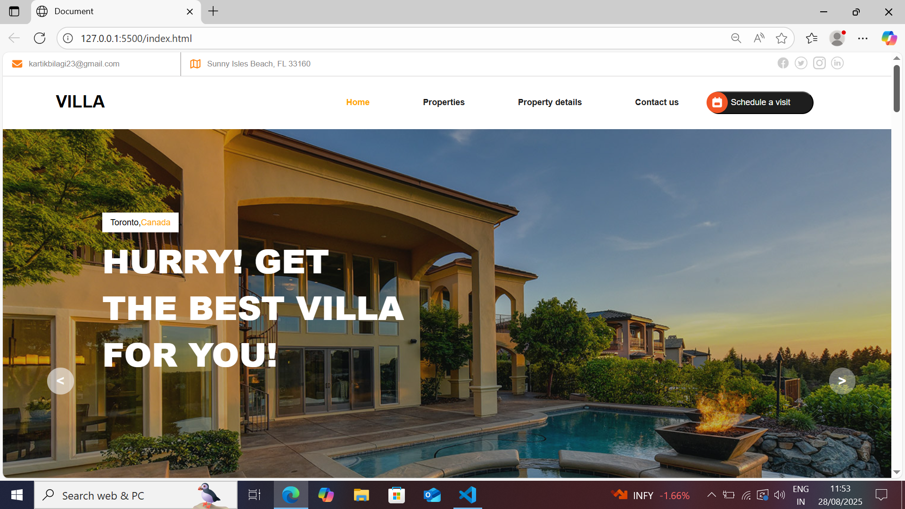
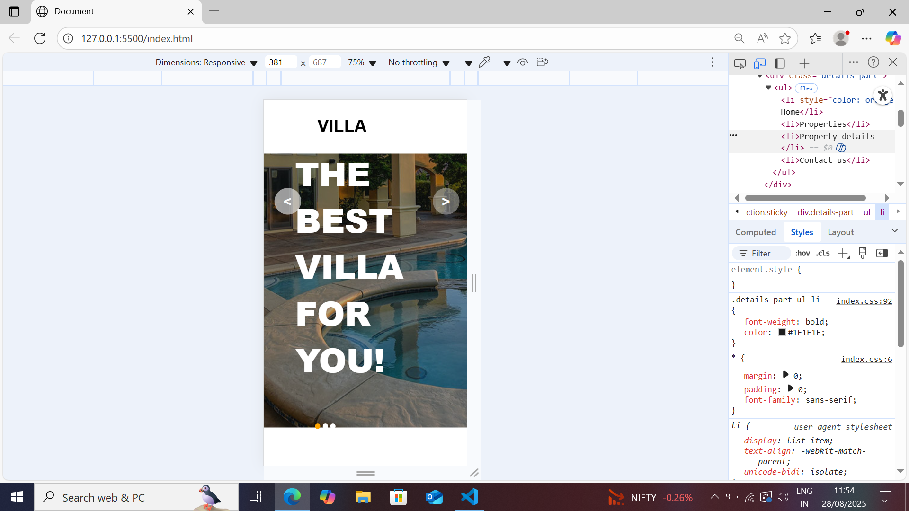

# Responsive Webpage 🌐

A clean and modern responsive website that adapts seamlessly to **mobile and desktop screens**.  
This project was created to practice **HTML, CSS, and responsive design principles**.  
The layout was inspired by external designs, but all code is written independently.

---

## 🚀 Features
- 📱 Mobile-first responsive design
- 💻 Optimized for desktop view
- 🎨 Simple and modern UI
- ⚡ Lightweight and fast

---

## 🛠️ Tech Stack
- **HTML5**
- **CSS3 (Flexbox, Grid, Media Queries)**
- **JavaScript**

---

## 📷 Screenshots
  


---

## 🌍 Live Demohttps:
👉 [View on GitHub Pages](https://your-kartikbilagi23.github.io/new-responsive-website
/)  

---

## 📦 Installation & Usage
Clone the repo and open `index.html` in your browser:
```bash
git clone https://github.com/your-username/responsive-webpage.git
cd responsive-webpage
